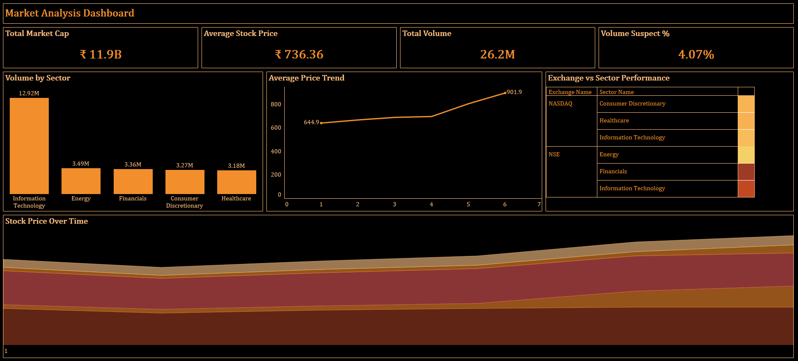
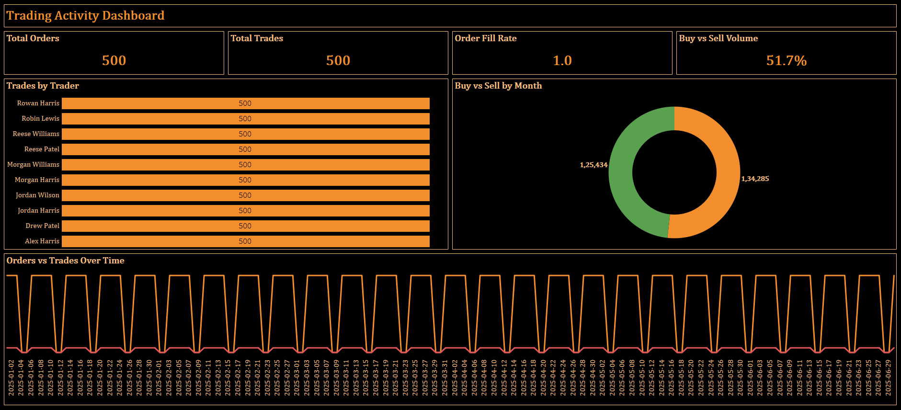
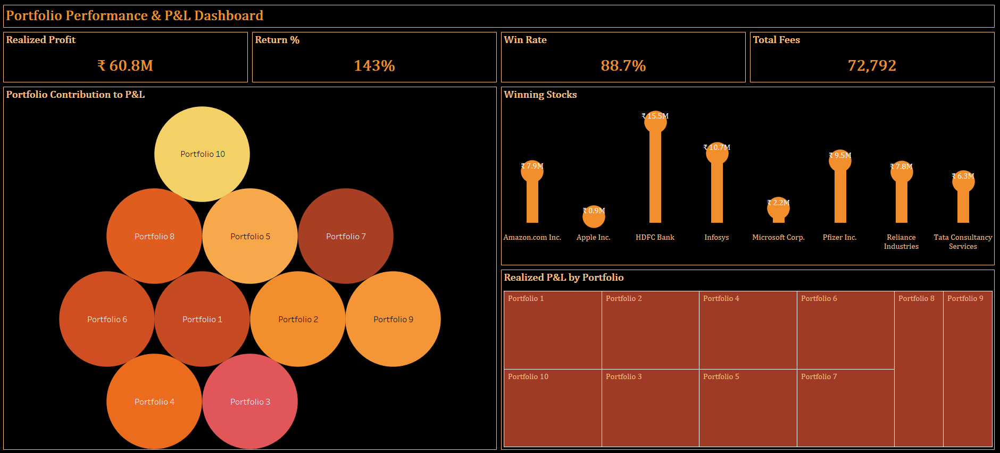

# 📈 Equity Trading & Portfolio Performance Dashboard  
**Advanced Tableau Project | Financial Analytics**

## 📌 Overview
An interactive Tableau dashboard analyzing **stock market trends, trading activity, and portfolio performance**.  
Designed to help stakeholders track **market behavior, execution efficiency, and realized P&L** using clean KPIs and intuitive visuals.

---

## ⭐ STAR Method Breakdown

### **S — Situation**
Market and trading data existed across multiple tables, making it difficult to:
- Analyze stock price & volume trends  
- Track trading efficiency  
- Measure portfolio profitability  

### **T — Task**
Build a **scalable Tableau analytics solution** that:
- Handles multiple fact tables correctly  
- Delivers market, trading, and P&L insights  
- Provides executive-ready dashboards  

### **A — Action**
- Designed a **multi-fact Tableau relational data model** using Relationships  
- Built **4 interactive dashboards**:
  - Market Analysis  
  - Trading Activity  
  - Portfolio Performance & P&L  
  - Executive Summary  
- Created key financial KPIs:
  - Market Capitalization
  - Realized Profit & Return %
  - Order Fill Rate
  - Win Rate
- Applied professional formatting, filters, and interactivity  

### **R — Result**
- Enabled clear visibility into **market trends and trading behavior**
- Identified **top-performing portfolios and stocks**
- Improved understanding of **profitability and execution efficiency**
- Delivered an **executive-ready analytics suite**

---

## 📌 Key Features
- Financial KPIs with currency & % formatting  
- Market price & volume trends  
- Trading efficiency analysis  
- Portfolio-level P&L insights  
- Interactive filters & tooltips  

---

## 📊 Dashboards

### 1️⃣ Market Analysis Dashboard
Analyzes stock price trends, volume behavior, sector and exchange performance.

### 2️⃣ Trading Activity Dashboard
Tracks order execution, trader performance and buy vs sell patterns.

### 3️⃣ Portfolio Performance & P&L Dashboard
Evaluates portfolio profitability, realized returns and winning trades.

---

## 🔗 Live Preview
([Live Dashboard](https://public.tableau.com/app/profile/shadansarfaraz/viz/EquityTradingPortfolioPerformanceDashboard/Dashboard3?publish=yes))

---

## 🧮 Key Calculated Fields
- Market Capitalization  
- Realized Profit  
- Return %  
- Order Fill Rate  
- Win Rate  
- Buy vs Sell Quantity  
- Volume Suspect %  

---

## 🎨 Features
- Tableau Relationships (multi-fact modeling)
- Global dashboard filters
- Financial KPI formatting (currency, %, M/B)
- Highlight & filter actions
- Dual-axis trend charts
- Clean executive UI & layout

---

## 📊 Tech Stack
- Tableau Desktop  
- Excel (Multi-Sheet Dataset)  
- Tableau Relationships  

---

## 🏁 Conclusion
This project demonstrates how complex **equity trading and portfolio data** can be transformed into **clear, actionable financial insights** through proper data modeling, advanced KPIs, and executive-focused dashboard design.  
It showcases strong skills in **financial analytics, Tableau modeling, and data storytelling**.

---

## 👤 Author
**Shadan Tech**   
_Data Analyst_

🔗 [LinkedIn Profile](https://www.linkedin.com/in/shadansarfaraz1)  
🔗 [Tableau Public Profile](https://public.tableau.com/app/profile/shadansarfaraz/vizzes)
🔗 [Newsletter](https://shadansarfaraz.substack.com/)

---

## ⭐ Show Your Support
If you found this project insightful, give it a **⭐ Star** on GitHub — it helps others discover it too!  
Connect on **LinkedIn** for more Power BI, Tableau, and Data Analytics projects.
